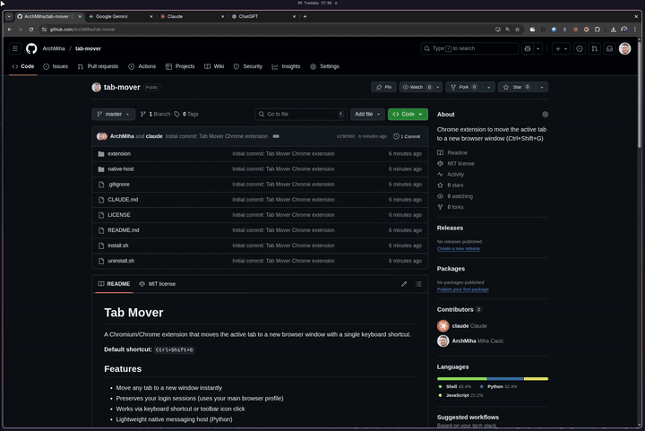

# Tab Mover

A Chromium/Chrome extension that moves the active tab to a new browser window with a single keyboard shortcut.

**Default shortcut:** `Ctrl+Shift+G`



## Features

- Move any tab to a new window instantly
- Preserves your login sessions (uses your main browser profile)
- Works via keyboard shortcut or toolbar icon click
- Lightweight native messaging host (Python)
- Supports Chromium and Google Chrome on Linux

## Installation

### Prerequisites

- Chromium or Google Chrome
- Python 3

### Steps

1. **Clone the repository**
   ```bash
   git clone https://github.com/ArchMiha/tab-mover.git
   cd tab-mover
   ```

2. **Load the extension in your browser**
   - Open `chrome://extensions`
   - Enable "Developer mode" (toggle in top right)
   - Click "Load unpacked" and select the `extension/` folder
   - Copy the 32-character extension ID shown below the extension name

3. **Run the installer**
   ```bash
   ./install.sh
   ```
   Paste the extension ID when prompted.

4. **Restart your browser** (recommended)

## Usage

- Press `Ctrl+Shift+G` to move the current tab to a new window
- Or click the extension icon in your toolbar

The original tab closes automatically and reopens in a fresh browser window with all your sessions intact.

### Customizing the Shortcut

1. Go to `chrome://extensions/shortcuts`
2. Find "Tab Mover to Isolated Instance"
3. Click the input field and press your preferred key combination

## How It Works

```
┌─────────────────────────────┐     Native Messaging     ┌──────────────────────────────┐
│   Chrome Extension          │◄───────────────────────►│   Python Native Host         │
│   (background.js)           │      JSON over stdio     │   (tab_mover_host.py)        │
│                             │                          │                              │
│   - Keyboard shortcut       │                          │   - Receives URL from ext    │
│   - Icon click handler      │                          │   - Opens URL in new window  │
│   - Closes original tab     │                          │     using default profile    │
└─────────────────────────────┘                          └──────────────────────────────┘
```

The extension uses Chrome's [Native Messaging API](https://developer.chrome.com/docs/extensions/develop/concepts/native-messaging) to communicate with a Python script that launches a new browser window.

## Uninstallation

```bash
./uninstall.sh
```

Then remove the extension from `chrome://extensions`.

## File Structure

```
tab-mover/
├── extension/
│   ├── manifest.json       # Extension manifest (Manifest V3)
│   ├── background.js       # Service worker
│   └── icons/              # Extension icons
├── native-host/
│   └── tab_mover_host.py   # Native messaging host
├── install.sh              # Installation script
├── uninstall.sh            # Uninstallation script
└── README.md
```

## Troubleshooting

**Shortcut doesn't work?**
- Check `chrome://extensions/shortcuts` to verify the shortcut is registered
- Some shortcuts may conflict with system or other extension shortcuts
- Try a different key combination

**"Native host not found" error?**
- Re-run `./install.sh` with the correct extension ID
- Restart your browser after installation

**Extension not working on certain pages?**
- Browser internal pages (`chrome://`, `about:`, etc.) cannot be moved due to browser security restrictions

## Contributing

Contributions are welcome! Feel free to open issues or submit pull requests.

## License

MIT License - see [LICENSE](LICENSE) for details.

## Acknowledgments

Built for the [Omarchy](https://github.com/basecamp/omarchy) community and Linux desktop users everywhere.
